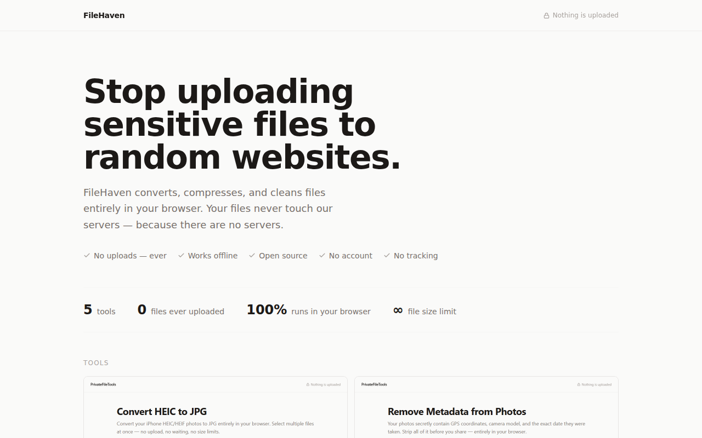

# FileHaven

Privacy-first, client-side file tools. Every operation runs entirely in the user's browser — no uploads, no backend, no data collection.

**Live:** [filehaven.pages.dev](https://filehaven.pages.dev)

## Why

Every file you give these tools — a HEIC photo, a PDF, anything — is processed with JavaScript running in your own browser tab and never leaves your device. There is no server that could receive it, log it, or get breached. You can disconnect from the internet after the page loads and the tools keep working — that's the proof.

## Self-hosting

It's a static Astro site — no backend, no env vars required: clone the repo, `npm install`, `npm run build`, then serve the `dist/` folder with any static host.

## Stack

- **Astro 6** — static site generator
- **Tailwind CSS 3** — utility-first CSS via PostCSS (`tailwind.config.cjs` + `postcss.config.cjs`)
- **TypeScript** — strict mode throughout
- **heic2any** — HEIC/HEIF → JPG, browser-side WebAssembly
- **piexifjs** — EXIF read/strip for JPEG (lazy-loaded)
- **pdfjs-dist** — PDF page rendering for rasterize mode (lazy-loaded)
- **pdf-lib** — PDF construction, merging, and optimize mode (lazy-loaded)

## Security

### Security headers (`public/_headers`)

Cloudflare Pages applies these headers to every response:

| Header | Value | Purpose |
|--------|-------|---------|
| `Content-Security-Policy` | `default-src 'self'; script-src 'self' 'wasm-unsafe-eval' static.cloudflare.com; style-src 'self'; img-src 'self' blob: data:; connect-src 'self' cloudflareinsights.com; …` | Restricts all executable resources to our origin + analytics. Blocks any third-party script from running. |
| `Strict-Transport-Security` | `max-age=31536000; includeSubDomains; preload` | Forces HTTPS for 1 year; preload-eligible. |
| `X-Content-Type-Options` | `nosniff` | Prevents MIME-type sniffing. |
| `Referrer-Policy` | `no-referrer` | Nothing is sent in the `Referer` header — files in transit stay private. |
| `Permissions-Policy` | `camera=(), microphone=(), geolocation=(), …` | Denies all sensitive browser APIs. |
| `X-Frame-Options` | `DENY` | Prevents clickjacking. |

**Third-party origins in the CSP** (the complete, audited list):

- `static.cloudflare.com` — Cloudflare Web Analytics beacon script (only loaded when `PUBLIC_CF_BEACON_TOKEN` is set)
- `cloudflareinsights.com` — where the beacon sends anonymised page-view counts

No other third-party origin is permitted. All npm libraries (heic2any, pdfjs-dist, pdf-lib, piexifjs) are bundled locally by Vite and served from `'self'`.

### Subresource Integrity (SRI) note

The Cloudflare Analytics beacon (`static.cloudflare.com/beacon.min.js`) is loaded without an SRI hash because Cloudflare does not version this URL — the hash would go stale whenever they update the script. Mitigation: the script is scoped to a trusted first-party CDN; the CSP restricts connections to `cloudflareinsights.com` only; and the script has no access to file data (it only reads the page URL). If you remove analytics, remove both domains from `public/_headers`.
